# Multi-Language (EN/VI) QA Screenshots

Manual on-device QA evidence for [ADR-0003](../docs/adr/0003-multi-language-support-en-vi.md) and
[the implementation plan](../docs/plans/plan-multi-language-support-en-vi.md).

Captured on a real device (Samsung Galaxy S21 FE, Android 15 / API 35) using
`adb shell cmd locale set-app-locales com.docscanner --user 0 --locales <locale>`
to force the app's language independently of the device's system language,
without adding any in-app language switcher (per ADR-0003 Decision B1).

## Vietnamese (`vi-VN`)

| # | Screen | Screenshot |
|---|--------|------------|
| 1 | Document List — empty state | 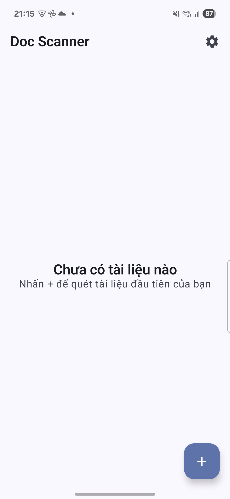 |
| 2 | Settings — version, doc count, storage, "Có gì mới" |  |
| 12 | Document List — with a real scanned document, correct singular/plural ("1 trang") | 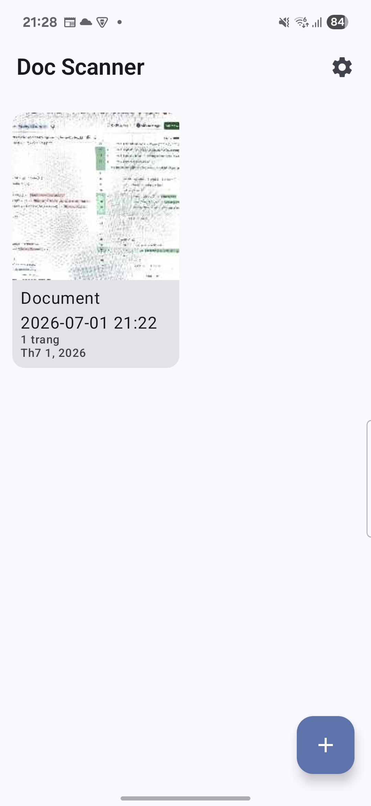 |
| 9 | Document List — long-press context menu (Đổi tên / Xuất PDF / Xóa) | 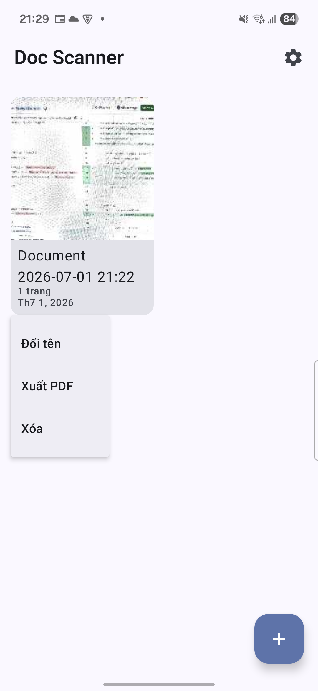 |
| 10 | Rename dialog | 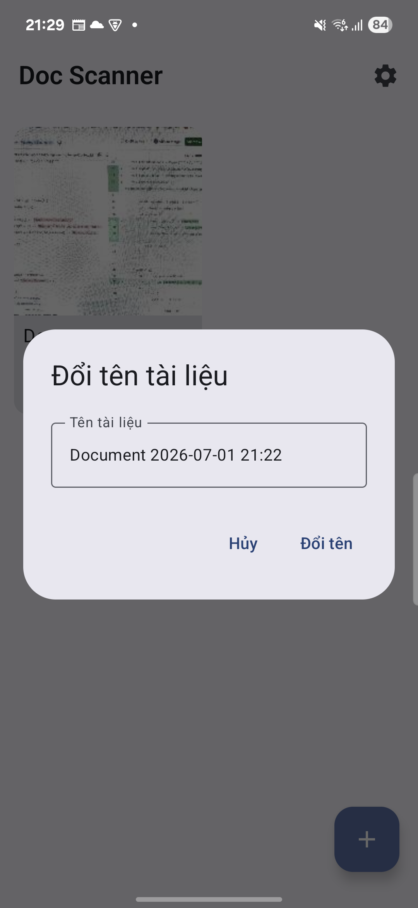 |
| 11 | Delete confirmation dialog | 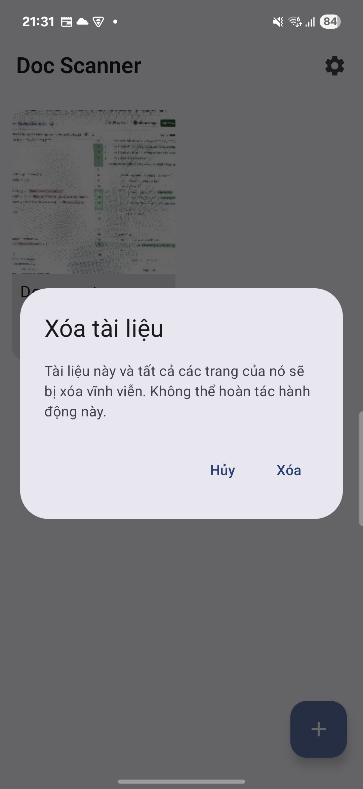 |
| 5 | Document Viewer — real scanned page, page indicator | 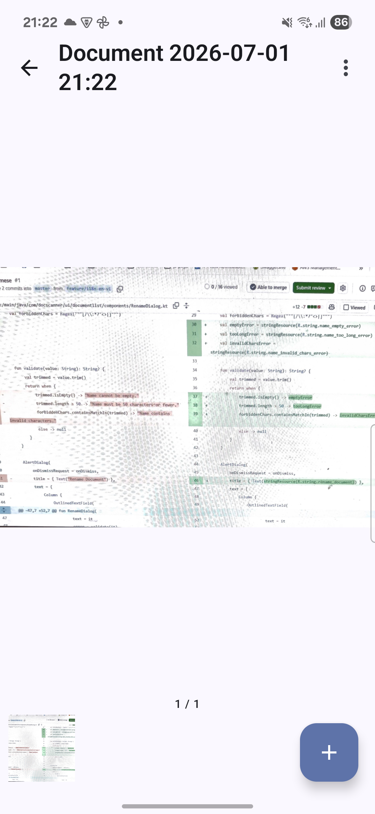 |
| 6 | Document Viewer — three-dot menu (Xuất PDF / Nhập từ thư viện ảnh / Chỉnh sửa trang / Xuất dưới dạng ảnh / Xóa trang) | 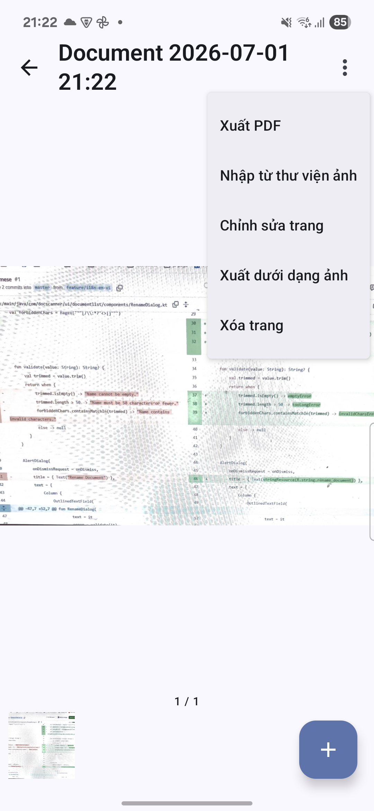 |
| 7 | Edit Page — rotate, brightness, contrast, grayscale | 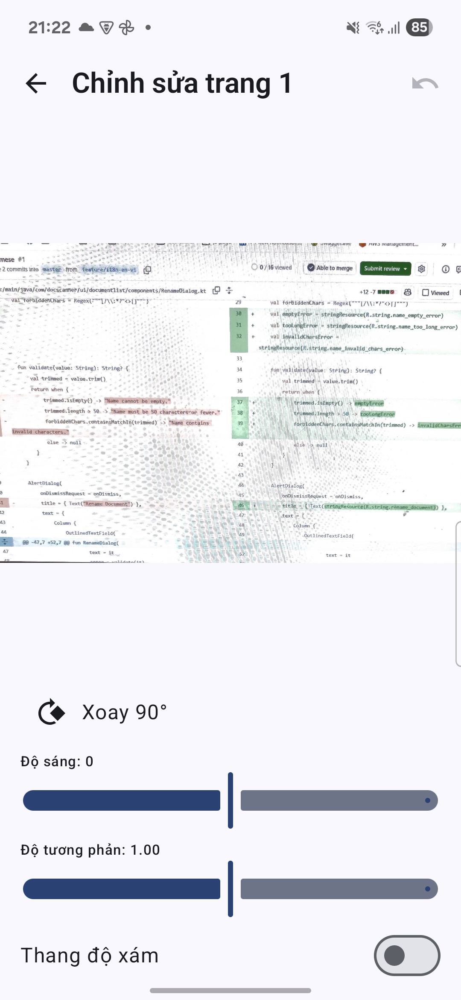 |
| 8 | Edit Page — discard-changes dialog | 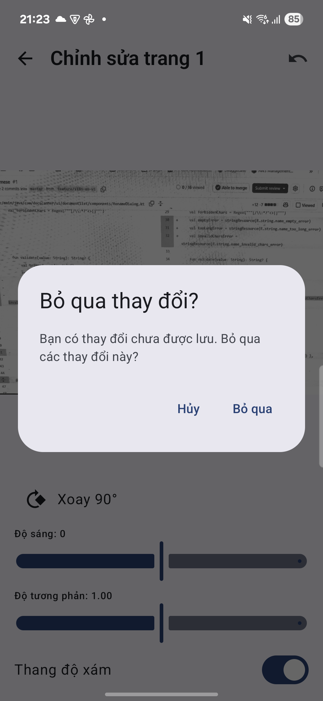 |

**Note on screenshot 7:** the contrast value renders as `Độ tương phản: 1.00` — a **period**, not a
comma — confirming the `Locale.US` fix ([ADR-0003 Decision C2](../docs/adr/0003-multi-language-support-en-vi.md))
correctly prevents `vi-VN`'s comma decimal separator from leaking into that display.

## English fallback check (`fr-FR`, no `values-fr/`)

Confirms the app falls back to English correctly when the forced locale has no matching resource file
(ADR-0003 Decision B1 — system-locale-only, standard Android resource resolution).

| # | Screen | Screenshot |
|---|--------|------------|
| 3 | Document List — empty state | 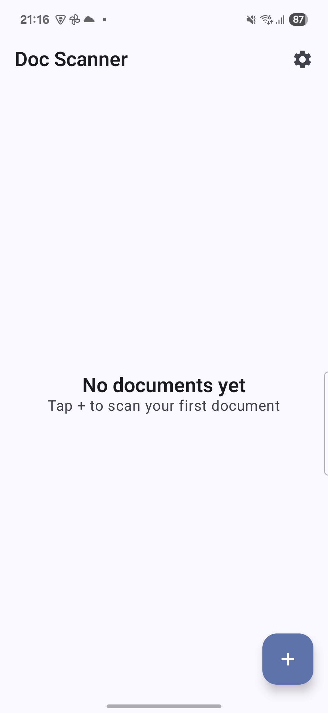 |
| 4 | Settings | 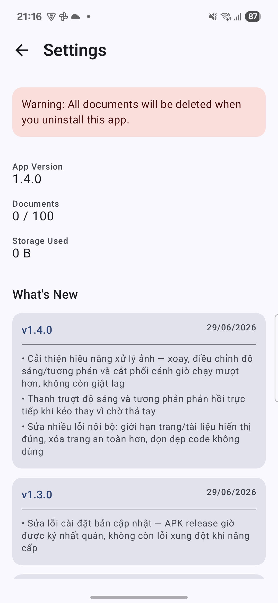 |

## Known gaps (not covered by these screenshots)

- Rename dialog's inline validation errors (empty name / too long / invalid characters) were not
  triggered on-device — verified by reading `values-vi/strings.xml` directly instead.
- `release_notes.yaml` content is hardcoded Vietnamese regardless of locale (visible in screenshot 4) —
  pre-existing, unrelated to this change, flagged as a follow-up in the PR.
- `DocumentCard`'s "updated" date (`SimpleDateFormat("MMM d, yyyy", Locale.getDefault())`) uses
  locale-correct Vietnamese month abbreviations but an English-order date layout (e.g. `Th7 1, 2026`) —
  a separate date-formatting design decision, not fixed here.
